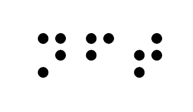

<!--
*** USED BEST README Template so leaving the references - ngil 01/14/2022
*** Thanks for checking out the Best-README-Template. If you have a suggestion
*** that would make this better, please fork the repo and create a pull request
*** or simply open an issue with the tag "enhancement".
*** Don't forget to give the project a star!
*** Thanks again! Now go create something AMAZING! :D
-->

<!-- PROJECT SHIELDS -->
<!-- 
*** I'm using markdown "reference style" links for readability.
*** Reference links are enclosed in brackets [ ] instead of parentheses ( ).
*** See the bottom of this document for the declaration of the reference variables
*** for contributors-url, forks-url, etc. This is an optional, concise syntax you may use.
*** https://www.markdownguide.org/basic-syntax/#reference-style-links
-->
[![Contributors][contributors-shield]][contributors-url]
[![Forks][forks-shield]][forks-url]
[![Stargazers][stars-shield]][stars-url]
[![Issues][issues-shield]][issues-url]
[![MIT License][license-shield]][license-url]
[![LinkedIn][linkedin-shield]][linkedin-url]

<!-- PROJECT LOGO -->
 

  

<h3 align="center">Transparent NFTs</h3>

  

    A multi-chain interface explorer, to make NFTs available to people with disabilities
     
    <a href="https://github.com/ratalie/TransparentNFTs"><strong>Explore the docs »</strong></a>
     
     
    <a href="https://github.com/ratalie/TransparentNFTs">View Demo</a>
    ·
    <a href="https://github.com/ratalie/TransparentNFTs/issues">Report Bug</a>
    ·
    <a href="https://github.com/ratalie/TransparentNFTs/issues">Request Feature</a>
  

<!-- TABLE OF CONTENTS -->

  
Table of Contents

  <ol>
    <li>
      <a href="#about-the-project">About The Project</a>
      <ul>
        <li><a href="#built-with">Built With</a></li>
      </ul>
    </li>
    <li>
      <a href="#getting-started">Getting Started</a>
      <ul>
        <li><a href="#prerequisites">Prerequisites</a></li>
      </ul>
    </li>
    <li><a href="#roadmap">Roadmap</a></li>
    <li><a href="#contributing">Contributing</a></li>
    <li><a href="#license">License</a></li>
    <li><a href="#contact">Contact</a></li>
  </ol>

<!-- ABOUT THE PROJECT -->
## About The Project
Setup a standard that all blockchains can use with a tag and the description on a field that is mainly unused.

(<a href="#top">back to top</a>)

<b>Problem</b> 
Currently, the NFT market is been focused on the creation and trading of graphic (static or animated, sound based) art. 

That leaves behind a great number of people with disabilities that cannot get the information of what the pieces of art are about, thus, cannot complete their research to be part of this ecosystem. 

Other people supporting them can be helpful, but we should consider a standard to include on the information inherent to the NFT 

<b>Solution</b> 
Setup a multi-chain interface explorer, if marketplaces, sites or apps do not have it implemented. A reusable component to read those additional attributes from all the chains, it is agnostic as far as the standard field to read is defined on each chain’s explorer interface (tested with ton.sh #API explorer, solana, etherscan, algoexplorer, polysgoncan and harmony explorer)

  
 Once the standard is well known, people receive incentive to complete the description for the NFTs  
… yes that’s tokens for that bounty—this should need graceful sponsors committed to diversity to fund! 

See demo
[ "Demo")

### Built With

* [ton.sh #API]
* [web3.js]
* [Moralis]
* [IPFS]
* [ENS]
* [JavaScript]
*

(<a href="#top">back to top</a>)

<!-- GETTING STARTED -->
## Getting Started

We are using APIs and some libraries

### Prerequisites

### Node
npm install web3
### Yarn
yarn add web3
### Moralis
Webpack v5
We highly recommend you to use the stable 4.0.3 version of Webpack. If you want to use Moralis on your project with Webpack v5 you need to add the fallback to your webpack.config.js file:

module.exports = {
    resolve: {
        fallback: {
            assert: require.resolve('assert'),
            crypto: require.resolve('crypto-browserify'),
            http: require.resolve('stream-http'),
            https: require.resolve('https-browserify'),
            os: require.resolve('os-browserify/browser'),
            stream: require.resolve('stream-browserify'),
        },
    },
};

const Moralis = require('moralis');
// ES6 Minimized
import Moralis from 'moralis/dist/moralis.min.js';

## Roadmap

- Proposed Standard to store information on every chain 
- Setup NFTs multichain explorer
- Setup incentive for people to contribute on descriptions
- Propose other platforms to include that capability

See the [open issues](https://github.com/ratalie/TransparentNFTs/issues) for a full list of proposed features (and known issues).

(<a href="#top">back to top</a>)

<!-- CONTRIBUTING -->
## Contributing

Contributions are what make the open source community such an amazing place to learn, inspire, and create. Any contributions you make are **greatly appreciated**.

If you have a suggestion that would make this better, please fork the repo and create a pull request. You can also simply open an issue with the tag "enhancement".
Don't forget to give the project a star! Thanks again!

1. Fork the Project
2. Create your Feature Branch (`git checkout -b feature/AmazingFeature`)
3. Commit your Changes (`git commit -m 'Add some AmazingFeature'`)
4. Push to the Branch (`git push origin feature/AmazingFeature`)
5. Open a Pull Request

(<a href="#top">back to top</a>)

<!-- LICENSE -->
## License

Distributed under the MIT License. See `LICENSE.txt` for more information.

(<a href="#top">back to top</a>)

<!-- CONTACT -->
## Contact

Your Name - [@ratalie](https://twitter.com/ratalie)  

Project Link: [https://github.com/ratalie/TransparentNFTs](https://github.com/ratalie/TransparentNFTs)

(<a href="#top">back to top</a>)

<!-- MARKDOWN LINKS & IMAGES -->
<!-- https://www.markdownguide.org/basic-syntax/#reference-style-links -->
[contributors-shield]: https://img.shields.io/github/contributors/ratalie/TransparentNFTs.svg?style=for-the-badge
[contributors-url]: https://github.com/ratalie/TransparentNFTs/graphs/contributors
[forks-shield]: https://img.shields.io/github/forks/ratalie/TransparentNFTs.svg?style=for-the-badge
[forks-url]: https://github.com/ratalie/TransparentNFTs/network/members
[stars-shield]: https://img.shields.io/github/stars/ratalie/TransparentNFTs.svg?style=for-the-badge
[stars-url]: https://github.com/ratalie/TransparentNFTs/stargazers
[issues-shield]: https://img.shields.io/github/issues/ratalie/TransparentNFTs.svg?style=for-the-badge
[issues-url]: https://github.com/ratalie/TransparentNFTs/issues
[license-shield]: https://img.shields.io/github/license/ratalie/repo_name.svg?style=for-the-badge
[license-url]: https://github.com/ratalie/TransparentNFTs/blob/master/LICENSE.txt
[linkedin-shield]: https://img.shields.io/badge/-LinkedIn-black.svg?style=for-the-badge&logo=linkedin&colorB=555
[linkedin-url]: https://linkedin.com/in/nataliegil
[product-screenshot]: images/screenshot.png
